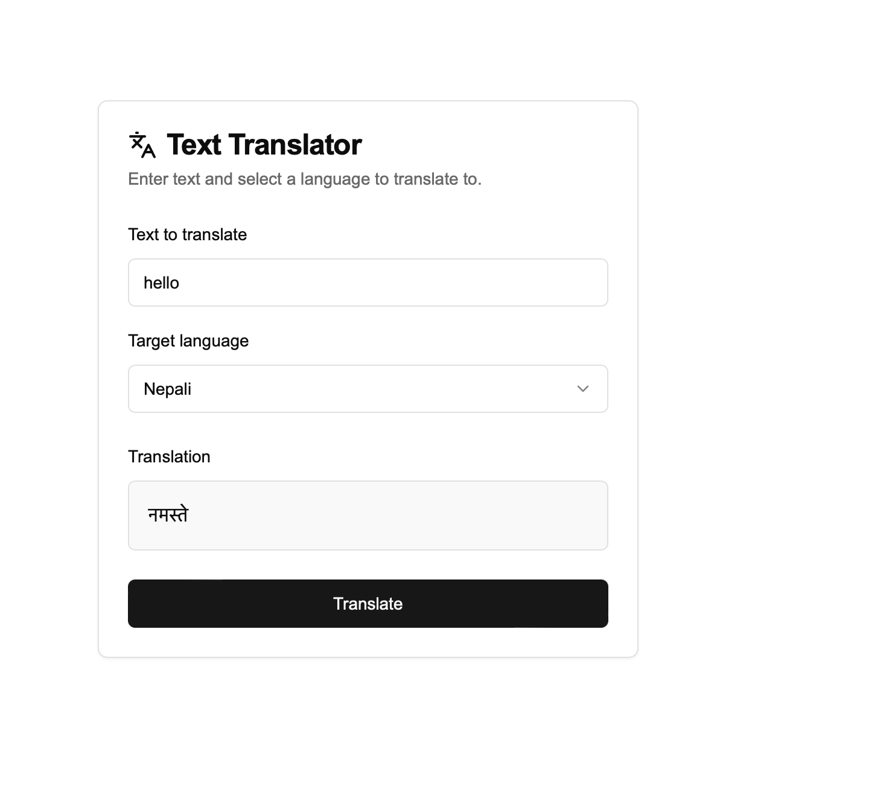

# Translation App

A simple text translation app built with Next.js, React, and Tailwind CSS. This app allows users to input text, select a target language, and get the translated text using the OpenL Translate API.

## Screenshot



## Features

- Translate text into multiple languages.
- Auto-detect the source language.
- Responsive and user-friendly UI.
- Error handling for invalid input or API issues.
- Loading indicator while the translation is in progress.

## Technologies Used

- **Next.js**: Framework for building the app.
- **React**: For managing the UI and state.
- **Tailwind CSS**: For styling the components.
- **OpenL Translate API**: For text translation.
- **Lucide Icons**: For icons used in the UI.

## Installation

1. Clone the repository:
   ```bash
   git clone https://github.com/your-username/translation-app.git
   cd translation-app
   ```
